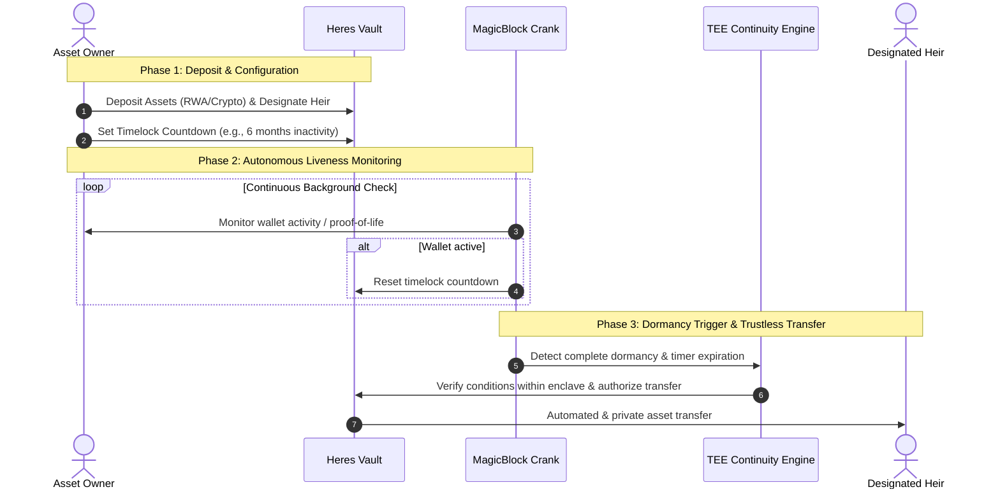

# Heres Protocol 

**The Trustless Digital Succession & Continuity Engine on Solana.**
Heres Protocol provides the essential safety net for the future of on-chain wealth. We ensure that self-custodied assets - ranging from crypto to tokenized Real World Assets (RWAs) and equities - are permanently protected from "dead key loss" and securely passed down to your loved ones.

## The Problem

As traditional equities and RWAs rapidly move on-chain, millions of users are taking self-custody of their assets. However, this massive shift comes with a critical vulnerability: **the loss of traditional legal succession safety nets**. 
If a user loses their private keys or unexpectedly passes away, their generational wealth is permanently lost. This friction is a massive barrier to the long-term institutional and retail adoption of on-chain wealth.

## Our Solution
Heres Protocol acts as a trustless continuity engine. Users can lock their assets into a time-locked **Vault**. If the user's wallet goes dormant and fails to provide a proof-of-life ping within a specified timeframe, the assets are automatically and securely transferred to designated heirs.
We move away from cold, complex crypto recovery processes. Our focus is on **warmth, continuity, and human connection** - making on-chain succession as seamless as a surprise gift for a loved one.

### Key Technologies
* **Solana Native:** Built for speed, low fees, and scalability.
* **100% Automated (MagicBlock Crank):** No manual claiming required. Background liveness checks run autonomously using MagicBlock infrastructure.
* **Ultimate Privacy (TEE):** Built using Trusted Execution Environments to ensure that succession logic, asset amounts, and heir identities remain completely confidential.

## User Flow

1. **Deposit & Lock:** Connect your Solana wallet and deposit assets (crypto or tokenized RWAs) into a secure Heres Vault.
2. **Set Succession Rules:** Designate an heir's wallet address and configure a time-lock duration (e.g., 6 months or 1 year of inactivity).
3. **Automated Monitoring:** MagicBlock Crank continuously monitors your wallet for proof-of-life activity in the background. As long as you remain active, the timer resets.
4. **Dormancy Trigger:** If your wallet goes completely dormant and the specified time-lock expires, the continuity engine is triggered.
5. **Trustless Transfer:** The Vault automatically and securely transfers your locked assets to your designated heir. No manual claims, no middlemen, and no exposed private keys.

## Architecture & Features

### 1. B2C Succession Vaults (Live on Devnet)
End-users can create time-locked vaults to protect their assets. 
* Currently integrated with demo assets from **Tessera** and **xStocks** to showcase succession for tokenized U.S. equities.
* Intuitive, human-centric UI/UX designed to remove friction.

### 2. B2B Continuity SDK (Upcoming)
An enterprise-grade SDK designed for Solana Treasuries, DAOs, and institutional custodians. 
* Prevents TVL (Total Value Locked) leakage due to lost keys.
* Plugs effortlessly into existing institutional workflows.

## Roadmap
- **Phase 1:** UI/UX Rebranding & Concept Validation (Completed)
- **Phase 2:** Devnet Launch & MagicBlock Crank Integration (Completed)
- **Phase 3:** Token-2022 Full Integration (Supporting advanced asset types like TBILLx) (Current)
- **Phase 4:** Mainnet Launch & B2B SDK Rollout
- **Phase 5:** Institutional Pilot Partnerships

## Community & Links

* **Website:** [heresprotocol.com]
* **Twitter/X:** [@HeresProtocol]
* **Linkedin:** [https://www.linkedin.com/company/heres-protocol/]

*Heres Protocol is proudly participating in the Colosseum Hackathon. We are a bootstrapped team currently seeking 1.5M in Seed funding to build the definitive safety net for the Internet Capital Markets.*
